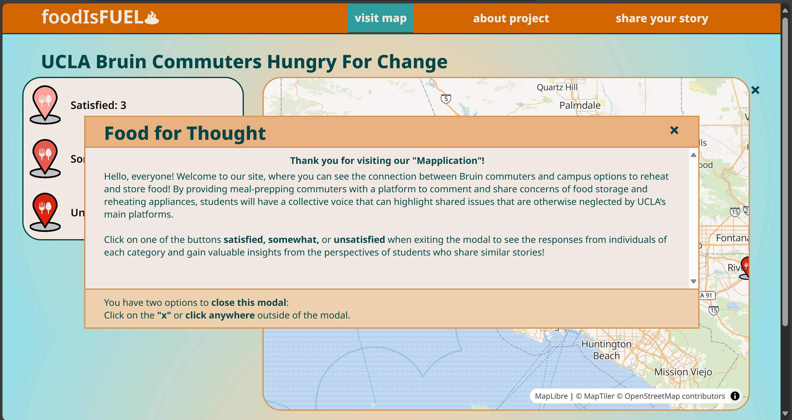

# Food is Fuel | UCLA Bruin Commuters Hungry For Change
> A web-based mapplication dedicated to sharing and learning about the experiences of UCLA commuter students who meal prep.
> Access it [here](https://pwinnie2026.github.io/group-ate/index.html).

## Table of Contents
* [Objective](#Objective)
* [Who is being empowered?](#Who-is-being-empowered?)
* [Technologies Used](#Technologies-used)
* [How it can be repurposed](#How-it-can-be-repurposed)
* [Features](#Features)
* [Acknowledgements](#Acknowledgements)
* [Contact Information](#Contact-Information)

## Objective
Commuter students are denied the option to purchase a meal plan at UCLA, leaving them responsible for arranging their meals while attending classes on campus. Additionally, with 43% of UCLA's off-campus population commuting more than an hour each way, commuter students may stay on campus late to beat evening traffic (Lopez, LA Times). We will survey UCLA commuter students on their experiences with food storage and reheating accessibility on campus. UCLA’s BruinHub, opened in 2021, provides only one fridge and microwave, and while it serves as a great start to providing resources for commuters, it is difficult to accommodate almost 30,000 undergraduate and graduate commuters (Hallisey, UCLA transportation). Housed in the Wooden Center, students’ meal prep resources are “out of the way of classes” (Rajha, BruinLife). 

We will survey UCLA commuter students to determine whether they meal prep and ask them about their experiences regarding food storage and reheating accessibility on campus. The survey aims to learn and understand UCLA commuter students’ meal-prepping struggles, specifically their experiences with food storage and reheating. 

In our mapplication, we will categorize responses by those who are satisfied, somewhat, or unsatisfied with their access to appliances such as fridges and microwaves to gain insight on meal-prepping commuter students. We hope to visualize spatial relationships and patterns, revealing shared experiences of potential inequities regarding the distribution of meal-prep resources across campus. 

## Who is being empowered?
We will empower student voices by centering the focus on student voices and sharing their concerns, which will be conducted by a community outreach survey of UCLA commuter students to gain perspective on how their experiences as commuters impact how they meal prep. By providing meal-prepping commuters with a platform to comment and share concerns about food storage and reheating appliances, students will have a collective voice that can highlight shared issues that are otherwise neglected by UCLA’s leading platforms.

## Technologies Used
We use a Google Form survey to collect user stories from UCLA commuter students, which will be displayed on our mapplication. The website uses HTML, CSS, and Javascript to create an interactive platform allowing users to choose what type of responses they would like to hear from. After selecting the categorical button, the user would then have to select a marker on the map to initiate the narrative window popup where they will be able to read the individuals' written responses.

The map was created using MapLibre, and with GeoJSON, we could visualize each response with markers. Using papa parse, we could link the survey responses to our map, allowing users and visitors to see where their responses were displayed geographically and instantly. As our data pertains to UCLA's commuter students, all users will have their marker correspond to the zip code from which they commute. Additionally, depending on their feelings toward access to appliances such as fridges (food storage) and microwaves (reheating), they will be identified in one of the three categories: satisfied, somewhat, and unsatisfied.

## How it can be repurposed
The information on the mapplication will be accessible to current and future students, empowering them to navigate and demand better food storage spaces on campus. Incoming commuter students can use it to learn from other students' experiences and adapt their meal prepping to best suit their commute. 

As more data is collected, it will serve as a tool to assess and track whether or not progress has been made and if commuter students continue to struggle with meal preparation due to a lack of access to food storage and reheating appliances. The data from our mapplication will be sent to community organizations, including cityLAB, the organization responsible for creating BruinHub, and the Commuter Support and Programs office staff. If issues persist, we will work alongside the student body representatives in the organizations to advocate for structural change and increase funding for more accessible meal-prep resources and equitable food storage solutions.

Overall, our project can provide an outlet for the community to share on-campus issues related to meal-prepping food accessibility faced by students who must plan and bring their meals from home. We hope that our website can continue to empower UCLA commuter students for years to come through continuous story-collecting as the campus grows and develops. We would greatly appreciate it if students could revisit our website to give updates on the status of food storage and appliance accessibility. Additionally, we hope that as time progresses and our user count increases, we can update and improve our mapplication to showcase user stories better and increase user satisfaction.

Our project was created to share our knowledge freely, so anyone can access the code and utilize all parts to help others build their own projects. We hope that anyone interested in our code will continue to hold the same ethics of design justice and have their projects remain open source as to keep knowledge accessible to all!

## Features
Our mapplication features color-coded markers that are divided into three categories of responses of whether students feel satisfied, somewhat satisfied, or unsatisfied with the access of fridges and microwaves on campus. 
### Default View ###

After selecting a category of satisfaction, the button filters through the responses and displays only the map markers that coordinate with that category. For example, a user can select "unsatisfied," only responses that feel dissatisfied with the access to fridges and microwaves will appear on the map. To further advance through the stories, the user will then select a specific marker on the map to open up a popup, coming from the right, that shares the responses from the survey that expand on the student's experiences with meal-prepping appliances on campus.
### Student Narratives ###

We encourage visitors to take the survey directly on the website by clicking the "share your story" tab. After submitting a response, a user will see their story appear on our map within 30 seconds.
### Survey Tab ###

## Acknowledgements
We couldn't have created this project without the support of many people. An overwhelming thank you to Professor Albert Kochaphum for guiding us through every process, working tirelessly with us to get our website running, and being a fantastic professor overall! Thank you to the AAS 191A Summer 2024 Session A class for participating in our project through the survey and words of encouragement!

## Contact Information
Created by [Nellie Nguyen](
nellienguyen149@g.ucla.edu), [Kiana Tran](kianaptran@gmail.com), and [Paige Wu](
paigewinniewu@g.ucla.edu). Please feel free to contact us if you have any questions!
